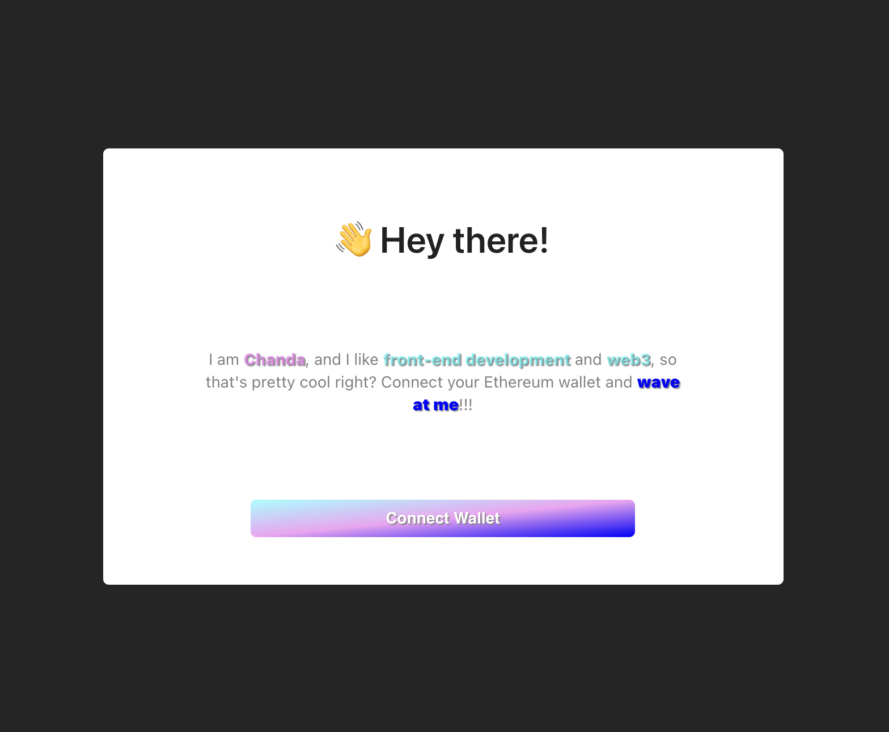
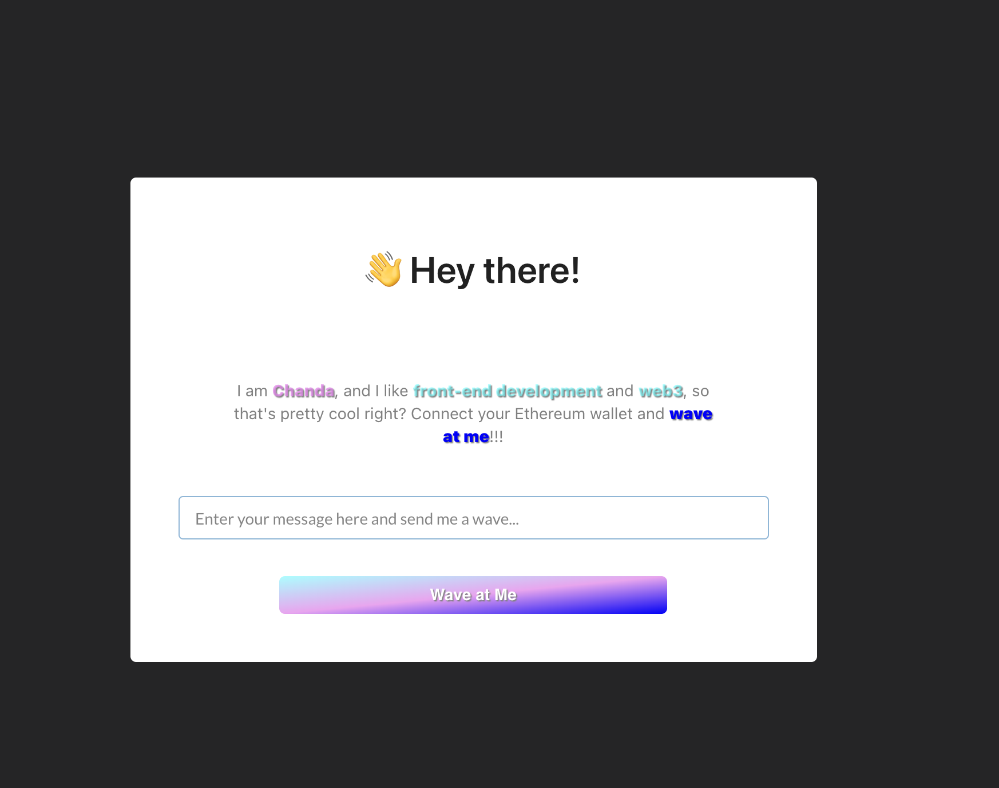
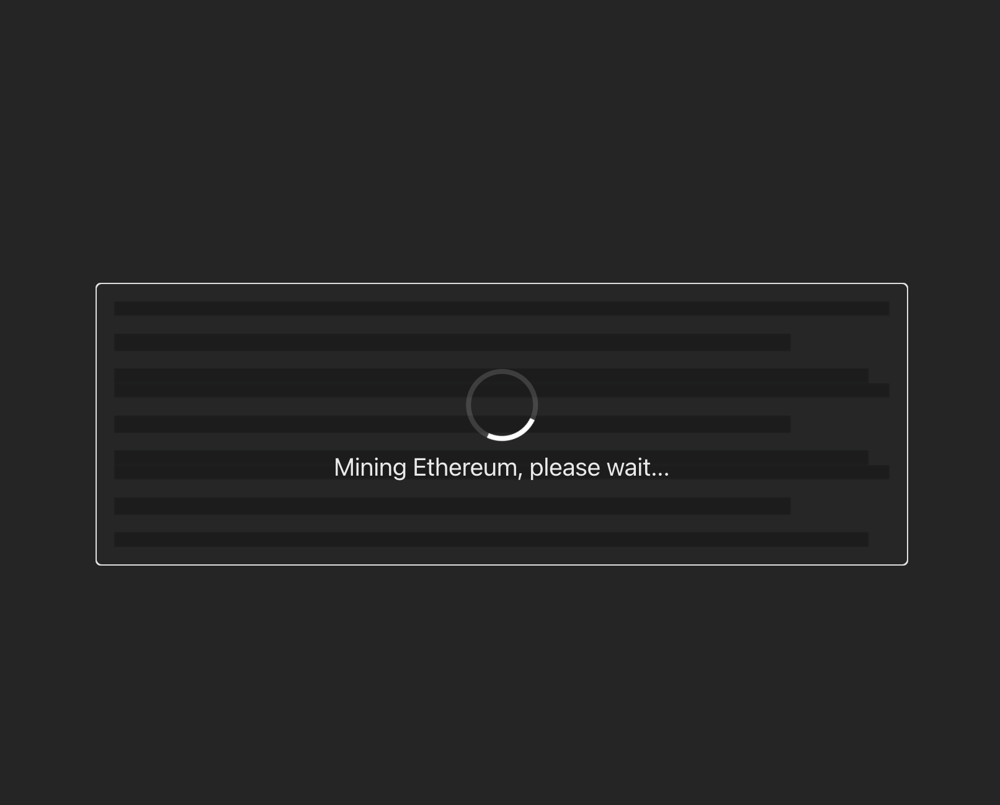
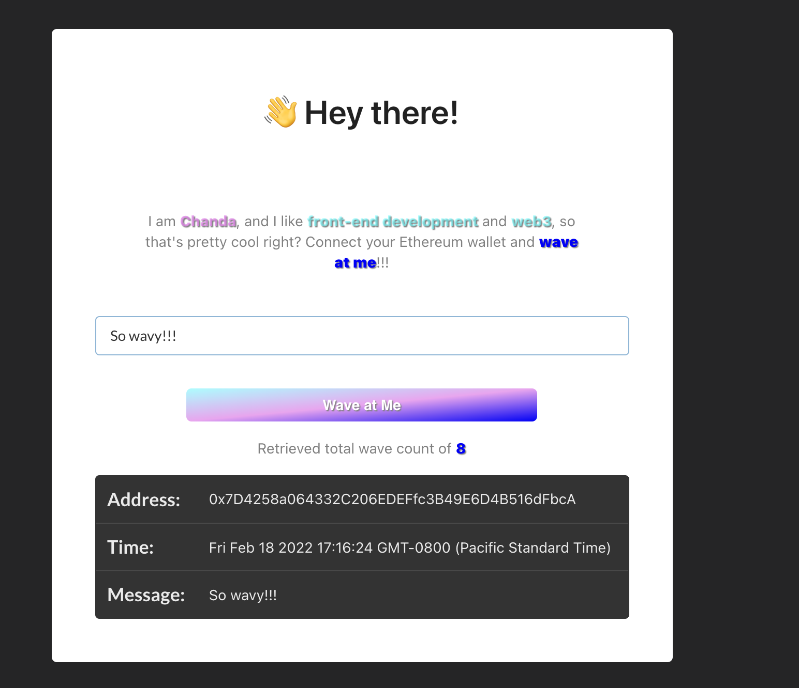
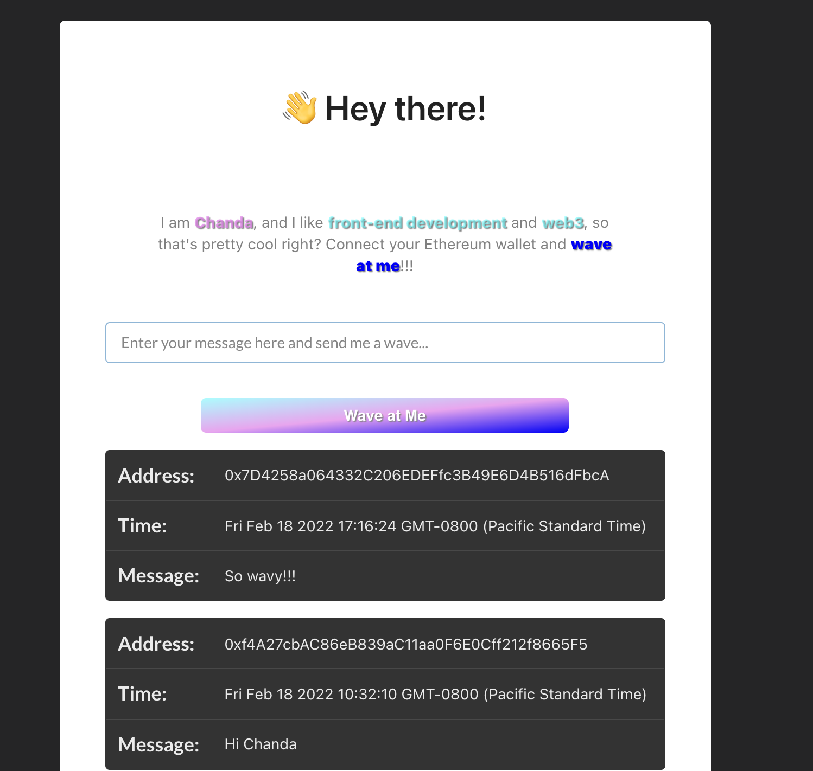

# [buildspace](https://buildspace.so/) Wave Portal 👋 
Web3 App with Solidity + Ethereum Smart Contracts

## Table of contents

- [Overview](#overview)
  - [The challenge](#the-challenge)
  - [Screenshot](#screenshot)
  - [Links](#links)
- [My process](#my-process)
  - [Built with](#built-with)
  - [What I learned](#what-i-learned)
  - [Continued development](#continued-development)
  - [Useful resources](#useful-resources)
- [Author](#author)
- [Acknowledgments](#acknowledgments)

## Overview

This is a solution to the [buildspace](https://buildspace.so/) challenge to build a <b>Web3 App with Solidity + Ethereum Smart Contracts</b>. [buildspace](https://buildspace.so/) is a platform to learn and build web3 projects alongside other devs.

This repo contains the front-end of my Web3 app.  You can view the repo for the [Solidity + Ethereum Smart Contracts here](https://github.com/Chanda-Abdul/waveportal-smart-contract).

I built this project to learn some Solidity, write + deploy a smart contract to the blockchain, and build a Web3 client app that can interact with your a smart contract, and to basically get comfortable building an entire Web3 App. 

## The challenge

### Users should be able to:

- [x] <b>View</b> landing page and understand the purpose of this app
- [x] <b>Connect</b> their ethereum <b>wallet</b> using Metamask, with the Rinkeby Test Network
- [x] <b>Input a message</b> and click button to send a "wave" to the smart contract owner
- [x] Once the "wave" is sent the "waver" is entered to <b>win a prize</b>, where the winner is chosen at random
- [x] While the user is waiting for their transaction to be mined on the blockchain a <b>loading message</b> is displayed to the UI, because of <b>blocktime<b> this message may be displayed for 15+ seconds
- [x] The <b>number of "wavers"</b> is displayed along with each wavers <b>address</b>, <b>time</b> that wave was sent, and a <b>message</b>.

### Smart Contract should be able to:

- [x] Deploy your WavePortal smart contract to a local Ethereum network
- [x] Build web3 app that connects to our wallet and talks to our WaveContract
- [x] Update WavePortal to randomly send lucky users waving at you some Ethereum
- [x] Update UI + deploy to an Ethereum testnet so anyone on the internet can wave at you using their wallet


## Screenshots

### Landing Page and connect wallet

### Send message along with your wave

### View loader while wave is being sent

### View your wave, number of wavers, and data for each waver



### Links

- Link to deployed Site: [Wave Portal Web3 dApp](https://gifted-aryabhata-929956.netlify.app/)
- Link to Solidity Smart Contract: [Wave Portal Smart Contact Code](https://github.com/Chanda-Abdul/waveportal-smart-contract)

## My process

### Built with

- Front-end
    - [React](https://reactjs.org/) - JavaScript Framework
        - [Semantic UI React](https://react.semantic-ui.com/) Components
    - CSS Flexbox
- [Smart-Contract](https://github.com/Chanda-Abdul/waveportal-smart-contract)
    - Solidity
        - Hardhat
    - Metamask
    - Rinkeby Test Net
        - Rinkeby Faucets
        - Etherscan
    - Blockchain

### What I learned

This was a useful and rewarding project for me.  I became interested in web3 and solidity and I really wanted to build a complete project because I knew that would be the most effect way to learn.  I ran into ALOT of roadblocks in previous projects because web3/solditity is a fairly new technology that is being continuously updated, and it's very hard to find documentation and resources that will work with different versions of solidity. 

This was my first successful completed web3 project. I really enjoyed that buildspace showed the step by step process of building a complete web3 project and providing a community that you can utilized to get help when you run into any blockers. 

One of the main tools that helped me complete this project was [Hardhat](https://hardhat.org/), which allows you to deploy your contracts, run tests and debug Solidity code without dealing with live environments. 

<!-- Use this section to recap over some of your major learnings while working through this project. Writing these out and providing code samples of areas you want to highlight is a great way to reinforce your own knowledge.

To see how you can add code snippets, see below:

```html
<h1>Some HTML code I'm proud of</h1>
```
```css
.proud-of-this-css {
  color: papayawhip;
}
```
```js
const proudOfThisFunc = () => {
  console.log('🎉')
}
``` -->


### Continued development

There are a few things that I would like to revist when I have the time.  The prize functionality is build into the smart contract, but I would like to add some feedback to the UI so that the user willl know that they entered the contest and alert them if they win.  I would also like to add UI feedback for any issues we may encouter, such as running out of gas, etc.


#### To-Do's

- [x] Fix `useEffect` for new wave events
- [x] Add alerts for out of gas, etc.
- [ ] Clean up
- [x] Deploy
- [x] write README.md
- [ ] add UI feedback and information for prize

### Useful resources

-  [Hardhat](https://hardhat.org/), which allows you to deploy your contracts, run tests and debug Solidity code without dealing with live environments. This really helped me understand how to build a smart contract in JavaScript kind of way.
- [Semantic UI React](https://react.semantic-ui.com/).  I used <b>Semantic UI Components</b> for the input box and the table that displays the waver's information.  I didn't want to spend a ton of time on these elements because the focus of this project was to build a fully functional smart contract. 

## Author

- Website - [Chanda Codes](https://chandacodes.com/)
- GitHub - [github.com/Chanda-Abdul](https://github.com/Chanda-Abdul)

## Acknowledgments

[buildspace](https://buildspace.so/) is a great resource if you want to get started with web3. I would highly recommend.


